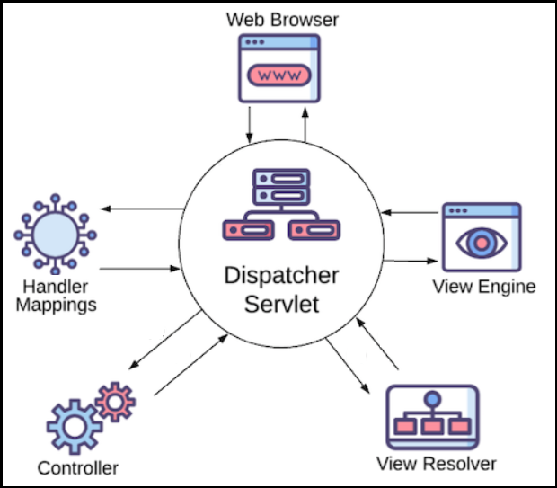

# [←](../README.md) <a id="home"></a> Spring Web MVC

Данный конспект относится к курсу **"[Open classrooms: Web Applications With the Spring Boot MVC Framework](https://openclassrooms.com/en/courses/5684146-create-mvc-applications-with-springboot)"**.

**Table of Contents:**
- [Spring Boot project](#boot)
- [Spring Boot MVC](#mvc)
- [Spring MVC Model](#model)
- [Form submission](#submit)
- [Fields Validation](#validation)
- [Configure Spring MVC](#configure)
- [Custom error page](#error)
- [Service Layer](#service)
- [Rest Template](#restTemplate)
- [Thymeleaf Fragments](#fragments)
- [Testing](#test)

----

## [↑](#home) <a id="boot"></a> Spring Boot project
Для начала нам понадобится создать проект.\
Воспользуемся системой сборки **[Gradle](https://gradle.org/)**.

В Gradle функциональность подключается при помощи плагинов.\
Одним из встроенных плагинов является плагин **[Gradle Build Init Plugin](https://docs.gradle.org/current/userguide/build_init_plugin.html)**.\
Данный плагин отвечает за инициализацию Gradle проекта.

Создадим каталог **"mvc"** и выполним в нём инициализацию Gradle проекта:
> gradle init

Нам подойдут настройки по умолчанию (basic project, Kotlin syntax), поэтому жмём Enter на вопросах.\
Согласно документации **Gradle Build Init Plugin**'а ответы так же можно давать и через аргументы. Например:
> gradle init --type basic --dsl kotlin --java-version 17

Как ранее было сказано, в Gradle функциональность реализуется при помощи различных плагинов.\
Добавим в проект поддержку Java при помощи **"[Gradle: The Java Plugin](https://docs.gradle.org/current/userguide/java_plugin.html)"**.

Подключим **Gradle Java Plugin** к проекту в билд файле **build.gradle.kts**:
```kts
plugins {
    java
}
```

Так как подключен java плагин, в билд скрипте можно использовать DSL, предоставляемый java плагином.\
Например, мы можем указать версию Java при помощи **[Java Toolchain](https://docs.gradle.org/current/userguide/java_plugin.html#sec:java-extension)**:
```kts
java {
    toolchain {
        languageVersion = JavaLanguageVersion.of(17)
    }
}
```

Кроме этого, Java рассчитывает на некоторую структуру файлов в проекте.\
Поэтому нам нужно подготовить **[Java Project Layout](https://docs.gradle.org/current/userguide/java_plugin.html#sec:java_project_layout)**.\
Создадим подкаталоги: ``src/main/java``, ``src/main/resources`` и ``src/test/java``.

Так же нам нужно указать репозиторий, в котором мы будем искать сторонние зависимости, такие как Spring:
```kts
repositories {
    mavenCentral()
}
```

Теперь подключим к проекту **[Spring Boot](https://spring.io/projects/spring-boot)**.\
На официальном сайте **[spring.io](https://spring.io/)** в разделе проектов выберем **[Spring Boot](https://spring.io/projects/spring-boot)**.\
В разделе **Learn** для текущей версии Spring Boot откроем **"[Reference Documentation](https://docs.spring.io/spring-boot/index.html)"**.     

Проверим требования Spring Boot к Java: **"[Spring Boot System Requirements](https://docs.spring.io/spring-boot/system-requirements.html)"**.\
Затем в разделе **"[Installing Spring Boot](https://docs.spring.io/spring-boot/installing.html)"** найдём секцию про **[установку при помощи Gradle](https://docs.spring.io/spring-boot/gradle-plugin/getting-started.html)**.

Согласно документации подключим плагин, который отвечает за знаниея об экосистеме Spring:
```kts
plugins {
    java
	id("org.springframework.boot") version "3.5.0"
}
apply(plugin = "io.spring.dependency-management")
```

Аналогичные действия могут быть выполнены при помощи **[Spring Starter](https://start.spring.io/)**.

Теперь проект готов к тому, чтобы его можно было открыть в любой IDE и продолжать работу.

----

## [↑](#home) <a id="mvc"></a> Spring Boot MVC
Проект теперь "знает" про экосистему Spring и мы можем подключить **Spring Web MVC**.

Так как мы используем Spring Boot, то подключать **Spring Web MVC** будем при помощи **[Spring Boot Starters](https://docs.spring.io/spring-boot/reference/using/build-systems.html#using.build-systems.starters)**:
```kts
dependencies {
    implementation("org.springframework.boot:spring-boot-starter-web")
    implementation("org.springframework.boot:spring-boot-starter-thymeleaf")
}
```
Как видно, мы подключаем две зависимости: сам **Spring Web MVC**, а так же **template engine**. 

Теперь нужно разобраться с тем, как выглядит и как устроен **Spring MVC** архитектура.

**MVC** - это сокращение от **Model - View - Controller**.\
Идея в разделении логики на 3 основные компонента: Model описывает данные, View описывает отображение данных, а Controller управляет тем, как это всё работает.

Spring Web MVC построен на основе **Servlet Api**.\
Центральной точкой входа (маршрутизации) является **DispatcherServlet**.\
Таким образом архитектура **Spring Web MVC** строится именно вокруг **DispatcherServlet**:



Благодаря наличию стартера **spring-boot-starter-web** Spring сам будет управлять запуском веб-сервера и настройкой сервлетов.

Согласно документации Spring, строго рекомендуется не использвать **default package**.\
Создадим отдельный пакет, в котором и будут располагаться наши классы.\
Подробнее см. документацию: **[Using the default Package](https://docs.spring.io/spring-boot/reference/using/structuring-your-code.html#using.structuring-your-code.using-the-default-package)**.

Создадим точку входа в нашу программу:
```java
package mvc;

public class App {
    public static void main(String[] args) {

    }
}
```

Благодаря плагину для Spring данное место будет автоматически сконфигурировано как **[main class](https://docs.spring.io/spring-boot/gradle-plugin/packaging.html#packaging-executable.configuring.main-class)** нашего Spring приложения.

В первую очередь, нужно указать, что это Spring Boot приложение (т.е. Spring Boot Application).\
Для этого воспользуемся аннотацией с говорящим названием **[@SpringBootApplication](https://docs.spring.io/spring-boot/reference/using/using-the-springbootapplication-annotation.html#page-title)**:
```java
@SpringBootApplication
public class App {
```

Теперь, нам нужно запустить наше Spring приложение (т.е. Spring Application):
```java
public static void main(String[] args) {
    SpringApplication.run(App.class, args);
}
```

После этого будет запущен веб-сервер (встроенный, является частью Spring Framework) и будет запущен тот самый **Dispatcher Servlet**.

Начнём с буквы **С** - c **Controller'а**.\
Для начала определимся с тем, какой подход выберем для организации проекта: **package-by-layer** или **package-by-feature**.\
Будем следовать примеру из документации Spring, плюс у нас маленькое демо приложение. Таким образом выбираем подход **package-by-feature**.\
Создадим пакет ``mvc.watchList``, а в нём класс ``WatchlistController``.

Воспользуемся Spring аннотациями, чтобы указать, что это котроллер:
```java
@Controller
public class WatchlistController {

}
```

Когда Dispatcher Servlet получит входящий запрос, ему нужно решить, что с этим запросом делать.\
Согласно правилам Spring Framework за предоставление маппинга отвечают **контроллеры**.\
Таким образом контроллер должен предоставить метод, который отвечает за обработку того или иного запроса.

```java
@GetMapping("/watchlist")
public ModelAndView getWatchlist() {
    Map<String, Object> model = new HashMap<String, Object>();
    model.put("numberOfMovies", "???");

    String viewName = "watchlist";
    return new ModelAndView(viewName, model);
}
```
Spring Web MVC предоставляет специальный класс **ModelAndView**, который объединяет информацию о том, какое представление (т.е. **View**) нужно использовать и данные (т.е. **Model**) для представления.

По умолчанию Spring Web MVC ищет шаблоны в каталоге ``src/resources/templates``.\
Добавим туда статический файл веб-страницы под названием ``watchlist.html``.\
Название файла должно совпадать с названием **view** из метода.

Содержимое нашей статической страницы:
```html
<html lang="en">
    <head>
        <meta charset="utf-8">
        <meta name="viewport" content="width=device-width, initial-scale=1">
        <title>Watchlist App</title>
        <link href="https://cdn.jsdelivr.net/npm/bootstrap@5.3.6/dist/css/bootstrap.min.css" rel="stylesheet"
            integrity="sha384-4Q6Gf2aSP4eDXB8Miphtr37CMZZQ5oXLH2yaXMJ2w8e2ZtHTl7GptT4jmndRuHDT" crossorigin="anonymous">
    </head>

    <body>
        <div class="container">
            <h2 class="mt-4">Watchlist</h2>
            <hr/>
            <div>
                <div>Number of movies to watch: <span>0</span></div>
            </div>
        </div>

        <script src="https://cdn.jsdelivr.net/npm/bootstrap@5.3.6/dist/js/bootstrap.bundle.min.js"
                integrity="sha384-j1CDi7MgGQ12Z7Qab0qlWQ/Qqz24Gc6BM0thvEMVjHnfYGF0rmFCozFSxQBxwHKO"
                crossorigin="anonymous"></script>
    </body>
</html>
```
Данная страница представляет из себя обычную статическую страницу.\
Можно заметить, что также используется **"[Bootstrap](https://getbootstrap.com/docs/5.3/getting-started/introduction/)"**.

Пока что это лишь статическая страница, но Spring может её "оживить".\
Для этого превратим стическую страницу в Thymeleaf шаблон.\
Для этого подключим к странице пространство имён Thymeleaf:
```html
<html lang="en" xmlns:th="http://www.thymeleaf.org">
```

А для вывода используем специальный синтаксис **"[Thymeleaf: Text literals](https://www.thymeleaf.org/doc/tutorials/3.1/usingthymeleaf.html#text-literals)"**:
```html
<div>Number of movies to watch: <span th:text="${numberOfMovies}"/></div>
```

Теперь, можно запустить наше Spring приложение.

Обратившись по URL ``http://localhost:8080/watchlist`` браузер пошлёт запрос нашему приложению. Dispatcher Servlet примет запрос, найдёт по watchlist маппинг в доступных контроллерах и выполнит соответствующий метод. Метод в свою очередь подготовит модель и отправит информацию о том, какое представление нужно "наполнить" данными из модели. Spring получит эту информацию, найдёт **ViewResolver** (который у нас есть благодаря наличию Thymeleaf), который совместит темплэйт и модель. В итоге ViewResolver вернёт нам данные, которые нужно будет показать пользователю.

----

## [↑](#home) <a id="model"></a> Spring MVC Model
Взаимодействие компонентов Spring MVC настроено. Теперь можно приступить к полноценной реализации отдельных компонентов.

Начнём с того, что создадим Java представление элемента, который мы будем отображать.\
Для этого воспользуемся специальным Java типом **Record**:
```java
public record WatchlistItem(Integer id, String title, String rating, String comment) {
    
}
```

Нам нужно некоторое хранилище пользователей.\
Такие хранилища называются репозиториями (**Repository**).\
Для начала опишем контракт при помощи интерфейса:
```java
public interface WatchlistItemRepository {
    WatchlistItem findById(Integer id);
    List<WatchlistItem> findAll();
    void save(WatchlistItem item);
}
```

Так как у нас нет базы данных, для простоты сделаем **In Memory** реализацию репозитория:
```java
@Repository
public class WatchlistItemInMemoryRepository implements WatchlistItemRepository {

    private final Map<Integer, WatchlistItem> items = new HashMap<>();;

    public WatchlistItemInMemoryRepository() {
        items.put(1, new WatchlistItem(1, "Lion King","8.5","Hakuna matata!"));
        items.put(2, new WatchlistItem(2, "Frozen","7.5","Let it go!"));
    }

    @Override
    public WatchlistItem findById(Integer id) {
        return items.get(id);
    }
    
    @Override
    public List<WatchlistItem> findAll() {
        return new ArrayList<>(items.values());
    }

    @Override
    public void save(WatchlistItem item) {
        this.items.put(item.id(), item);
    }
}
```

Теперь нужно настроить контроллер на работу с репозиторием **WatchlistItem**'ов:
```java
@Controller
public class WatchlistController {

    private final WatchlistItemRepository itemRepository;

    public WatchlistController(WatchlistItemRepository itemRepository) {
        this.itemRepository = itemRepository;
    }
```
Как мы видим, мы не создаём репозиторий вручную. За нас это сделает Spring благодаря **"[Constructor-based Dependency Injection](https://docs.spring.io/spring-framework/reference/core/beans/dependencies/factory-collaborators.html#beans-constructor-injection)"**. Наш репозиторий помечен как **@Repository**. Если посмотреть на устройство данной аннотации, то мы увидим, что это Spring **@Component**, а следовательно Spring создаст бин для него. А раз есть бин, значит его можно добавлять по требованию.


Изменим метод ``getWatchlist``, чтобы он возвращал данные из репозитория:
```java
@GetMapping("/watchlist")
public ModelAndView getWatchlist() {
    List<WatchlistItem> items = itemRepository.findAll();
    Map<String, Object> model = new HashMap<String, Object>();
    model.put("watchlistItems", items);
    model.put("numberOfMovies", items.size());
        
    String viewName = "watchlist";
    return new ModelAndView(viewName, model);
}
```

В темплэйте ``watchlist.html`` после тэга ``hr`` добавим **[таблицу](https://getbootstrap.com/docs/5.3/content/tables/)**.\
При помощи конструкции Thymeleaf **[th:each](https://www.thymeleaf.org/doc/tutorials/3.1/usingthymeleaf.html#using-theach)** заполним таблицу:
```html
<table class="table">
    <thead class = "thead-light">
        <tr>
            <th class="text-left">Title</th>
            <th class="text-left">Rating</th>
            <th class="text-left">Comment</th>
            <th class="text-left"></th>
        </tr>
    </thead>
    <tbody>
        <tr th:each="watchlistItem : ${watchlistItems}">
            <td th:text="${watchlistItem.title}">Avatar</td>
            <td th:text="${watchlistItem.rating}">7.8</td>
            <td th:text="${watchlistItem.comment}">Peter recommended</td>
            <td><a href="#" class="btn btn-info" role="button">Update</a></td>
        </tr>
    </tbody>
</table>
```
Как мы видим, синтаксис чем-то похож на конструкции из Java.\
Например, ``th:each="watchlistItem : ${watchlistItems}"`` означает, что для каждого элемента из коллекции ``${watchlistItems}`` (это название атрибута из модели) мы создадим новый элемент ``tr``, при этом к элементу можно обращаться через имя ``watchlistItem``.

Теперь, перезапустив приложение, мы получим вывод элементов репозитория в таблицу, доступную по URL ``http://localhost:8080/watchlist``.

----

## [↑](#home) <a id="submit"></a> Form submission
Наше приложение умеет читать данные, но пока что не умеет их изменять.

Добавим в контроллер новый маппинг для отображения формы элемента:
```java
@GetMapping("/watchlistItemForm")
public ModelAndView showWatchlistItemForm() {
    Map<String,Object> model = new HashMap<String,Object>();
    WatchlistItem item = new WatchlistItem();
    model.put("watchlistItem", item);

    String viewName = "watchlistItemForm";
    return new ModelAndView(viewName,model);
}
```

И создадим новый темплэйт с указанным именем ``watchlistItemForm.html``.\
Начало и конец страницы скопируем из темплэйта ``watchlist.html`` для удобства. 

В контейнере же вместо таблицы создадим форму при помощи **[Form](https://getbootstrap.com/docs/5.3/forms/overview/)**:
```html
<div class="container">
    <h2 class="mt-4">Submit an item</h2>
    <hr/>
    <form></form>
</div>
```

Настроим форму согласно документации **"[Thymeleaf + Spring](https://www.thymeleaf.org/doc/tutorials/3.1/thymeleafspring.html#creating-a-form)"**.\
Укажем для формы название локальной переменной при помощи ``th:object``, а так же **[укажем значение](https://www.thymeleaf.org/doc/tutorials/3.1/usingthymeleaf.html#setting-value-to-specific-attributes)** action при помощи **Thymeleaf Link URL Expression**:
```html
<form action="#" method="post" th:action="@{/watchlistItemForm}" th:object="${watchlistItem}">
</form>
```

Далее наполним форму полями ввода согласно **"[Thymeleaf: Inputs](https://www.thymeleaf.org/doc/tutorials/3.1/thymeleafspring.html#inputs)"** и **[Bootstrap Form Control](https://getbootstrap.com/docs/5.3/forms/form-control/)**:
```html
<div class="form-group row ">
    <label for="title" class="col-sm-2 col-form-label">Title</label>
    <div class="col-sm-4">
        <input id="title" th:field="*{title}" type="text" class="form-control" placeholder="Mandatory">
    </div>
</div>

<div class="form-group row ">
    <label for="rating" class="col-sm-2 col-form-label mr-0">Rating</label>
    <div class="col-sm-4">
        <input id="rating" th:field="*{rating}" type="text" class="form-control" placeholder="1.0 < Number < 10.0">
    </div>
</div>

<div class="form-group row">
    <label for="comments" class="col-sm-2 col-form-label">Comments</label>
    <div class="col-sm-4">
        <textarea id="comments" th:field="*{comment}" class="form-control" rows="3" placeholder="Max. 50 chars"></textarea>
    </div>
</div>

<div class="form-group row">
    <div class="col-sm-10">
        <button type="submit" class="btn btn-primary">Submit</button>
    </div>
</div>
```

Так как Record неизменяемый, добавим метод, который будет возвращать новый экземпляр, но уже с заполненным ID:
```java
public WatchlistItem withId(Integer id) {
    return new WatchlistItem(id, this.title(), this.rating(), this.comment());
}
```

Форма отправляется POST запросом, а значит нам нужно указать соответствующий маппинг в контроллере:
```java
@PostMapping("/watchlistItemForm")
public ModelAndView submitWatchlistItemForm(@ModelAttribute WatchlistItem watchlistItem) {
    int newId = itemRepository.findAll().size() + 1;
    itemRepository.save(watchlistItem.withId(newId));
        
    RedirectView redirectView = new RedirectView();
    redirectView.setUrl("/watchlist");
    return new ModelAndView(redirectView);
}
```
Важно отметить, что используется аннотация **@ModelAttribute**.\
При использовании данной аннотации Spring будет создавать новый экземпляр Record используя конструктор. Это обязательно, т.к. у Record нету сеттеров.

Теперь, когда мы умеем открывать форму, мы можем добавить функцию обновления элемента.\
Для этого немного обновим маппинг:
```java
@GetMapping("/watchlistItemForm")
public ModelAndView showWatchlistItemForm(@RequestParam(required=false) Integer id) {
    Map<String,Object> model = new HashMap<String,Object>();
    WatchlistItem item = itemRepository.findById(id);
    if (item == null) item = new WatchlistItem();
    model.put("watchlistItem", item);

    String viewName = "watchlistItemForm";
    return new ModelAndView(viewName,model);
}
```

Теперь мы можем в темплэйте ``watchlist.html`` немного изменить описание кнопки Update для обновления данных:
```html
<td><a href="#" class="btn btn-info" role="button" 
    th:href="@{/watchlistItemForm(id=${watchlistItem.id})}">Update</a></td>
```

Кроме этого нужно подправить маппинг для отправки (сабмита) формы:
```java
@PostMapping("/watchlistItemForm")
public ModelAndView submitWatchlistItemForm(@ModelAttribute WatchlistItem watchlistItem) {
    WatchlistItem item = itemRepository.findById(watchlistItem.id());
    if (item == null) {
        int newId = itemRepository.findAll().size() + 1;
        item = watchlistItem.withId(newId);
    } else {
        item = watchlistItem;
    }
    itemRepository.save(item);
        
    RedirectView redirectView = new RedirectView();
    redirectView.setUrl("/watchlist");
    return new ModelAndView(redirectView);
}
```

Осталось хранить данные про id на стороне страницы формы (но не отображать), чтобы при отправке формы эти данные нам передавались на сервер.\
Подправим ``watchlistItemForm.html``:
```html
<div class="col-sm-10">
    <input type="hidden" th:field="*{id}" />
    <button type="submit" class="btn btn-primary">Submit</button>
</div>
```

----

## [↑](#home) <a id="validation"></a> Fields Validation
Итак, у нас есть форма с полями. Неплохо было бы проверять поля на корректность.\
Для этого мы можем при помощи стартера подключить к проекту валидацию полей:
```kts
implementation("org.springframework.boot:spring-boot-starter-validation")
```

Тогда при помощи аннотаций мы можем рассказать какие поля и как нужно валидировать (т.е. указать правила):
```java
public record WatchlistItem(Integer id,
                            @NotBlank(message = "Please enter the title")
                            String title,
                            String rating,
                            @Size(max = 50, message = "Comment should be maximum 50 characters")
                            String comment) {
```

Проверять поля будем при отправке данных формы, т.е. нас интересует маппинг ``submitWatchlistItemForm``:
```java
@PostMapping("/watchlistItemForm")
public ModelAndView submitWatchlistItemForm(@Valid @ModelAttribute WatchlistItem watchlistItem, BindingResult check) {
    if (check.hasErrors()) {
        return new ModelAndView("watchlistItemForm");
    }
```

Теперь нужно в темплэйт ``watchlistItemForm.html`` добавить отображение проверки.\
Добавим отображение ошибок для title при помощи **[th:errors](https://www.thymeleaf.org/doc/tutorials/3.1/thymeleafspring.html#validation-and-error-messages)**:
```html
<div class="col-sm-4">
    <input id="title" th:field="*{title}" type="text" class="form-control" placeholder="Mandatory">
</div>
<div class="col-sm-4">
    <span class="text-danger" th:errors="*{title}"> </span>
</div>
```

Аналогичным образом добавим отображение ошибок для комментария:
```html
<div class="col-sm-4">
    <textarea id="comments" th:field="*{comment}" class="form-control" rows="3" placeholder="Max. 50 chars"></textarea>
</div>
<div class="col-sm-4">
    <span class="text-danger" th:errors="*{comment}"> </span>
</div>
```

Из интересного - можно создавать свои собственные правила валидации.\
Создадим для них отдельный пакет ``mvc.validation``.

Опишем аннотацию для валидации:
```java
@Target({ElementType.FIELD})
@Retention(RetentionPolicy.RUNTIME)
@Constraint(validatedBy = RatingValidator.class)
public @interface Rating {

    String message() default "Rating should be a number between 1-10";

    Class<?>[] groups() default {};

    Class<? extends Payload>[] payload() default {};
}
```

И напишем сам валидатор:
```java
public class RatingValidator implements ConstraintValidator<Rating, String> {
    @Override
    public boolean isValid(String value, ConstraintValidatorContext context) {
        try {
            double number = Double.parseDouble(value);
            return number >= 1 && number <= 10;
        } catch (NumberFormatException e) {
            return false;
        }
    }
}
```

Теперь данный валидатор можно повесить на поле rating и добавить его в темплэйт:
```html
<div class="col-sm-4">
    <input id="rating" th:field="*{rating}" type="text" class="form-control" placeholder="1.0 < Number < 10.0">
    <span class="text-danger" th:errors="*{rating}"></span>
</div>
```

Можно так же создать так называемый **cross-field validation**.\
Такая валидация применяется ко всему проверяемому элементу целиком:
```java
@GoodMovie
public record WatchlistItem(
```

Тогда аннотация будет выглядеть следующим образом:
```java
@Target(ElementType.TYPE)
@Retention(RetentionPolicy.RUNTIME)
@Constraint(validatedBy = GoodMovieValidator.class)
public @interface GoodMovie {
    String message() default "If a movie is as good as 8 then comment should not be empty";
    Class<?>[] groups() default {};
    Class<? extends Payload>[] payload() default {};
}
```

А валидатор так:
```java
public class GoodMovieValidator implements ConstraintValidator<GoodMovie, WatchlistItem> {
    @Override
    public boolean isValid(WatchlistItem value, ConstraintValidatorContext context) {
        try {
            double rating = Double.parseDouble(value.rating());
            if (rating >= 8) return !value.comment().isEmpty();
        } catch (Exception e) {
            return true;
        }
        return true;
    }
}
```

Не забудем добавить в темплэйт элемент для отображения ошибок:
```html
<form action="#" method="post" th:action="@{/watchlistItemForm}" th:object="${watchlistItem}">
    <div class = "form-group row ">
        <div class="col-sm-8">
            <span class="text-danger" th:errors="*{global}"> </span>
        </div>
    </div>
```

Так же из интересного - мы можем сами изменять результаты валидации из кода.\
Например, для ``submitWatchlistItemForm`` добавим проверку, что запись уже существует:
```java
WatchlistItem item = itemRepository.findById(watchlistItem.id());
if (item == null) {
    boolean isPresent = itemRepository.findAll()
            .stream().anyMatch((str) -> str.title().equals(watchlistItem.title()));
    if (isPresent) {
        check.rejectValue("title", "", "This movie is already on your watchlist");
        return new ModelAndView("watchlistItemForm");
    }
```

Однако, это неправильно такую логику держать вне репозитория.\
Например, если бы это была SQL база данных, то поиск по title куда эффективнее выполнить её средствами, а не получать все записи из БД.

Поэтому, добавим в контракт репозитория метод получения записи по заголовку ``findByTitle``:
```java
public interface WatchlistItemRepository {
    WatchlistItem findById(Integer id);
    WatchlistItem findByTitle(String title);
```

И реализацию в ``WatchlistItemInMemoryRepository``:
```java
@Override
public WatchlistItem findByTitle(String title) {
    return items.values().stream().findAny()
            .filter((str) -> str.title().equals(title))
            .orElse(null);
}
```

Тогда проверка будет обращаться к репозиторию:
```java
boolean isPresent = itemRepository.findByTitle(watchlistItem.title()) != null;
```
Как видно, логика работы find by title теперь не живёт в контроллере, т.к. он не должен этим заниматься.

----

## [↑](#home) <a id="configure"></a> Configure Spring MVC
Теперь разберёмся с тем, как менять предустановленные конфигурации **Spring MVC**.

Создадим для конфигураций отдельный пакет ``mvc.config`` и добавим собственную конфигурацию:
```java
@Configuration
public class MvcConfig implements WebMvcConfigurer {

    @Override
    public void addViewControllers(ViewControllerRegistry registry) {
        registry.addViewController("/").setViewName("home.html");
    }
}
```

Теперь создадим темплэйт для этой страницы.\
Как обычно, сама страница выглядит так же, как и все остальные.\
В body добавим контейнер:
```html
<div class="container">
</div>
```

Добавим **[Bootstrap Navbar](https://getbootstrap.com/docs/5.3/components/navbar/)**:
```html
<nav class="navbar navbar-expand-sm navbar-dark bg-secondary">
    <a class="navbar-brand" href="home.html">Watchlist App</a>
    <button class="navbar-toggler" type="button" data-toggle="collapse"
            data-target="#navbarSupportedContent"
            aria-controls="navbarSupportedContent" aria-expanded="false"
            aria-label="Toggle navigation">

        <span class="navbar-toggler-icon"></span>
    </button>

    <div class="collapse navbar-collapse" id="navbarSupportedContent">
        <ul class="navbar-nav mr-auto">
            <li class="nav-item">
                <a class="nav-link active" href="/">Home</a>
            </li>
            <li class="nav-item">
                <a class="nav-link" href="/watchlist">Watchlist</a>
            </li>
            <li class="nav-item ">
                <a class="nav-link" href="/watchlistItemForm">Submit an item</a>
            </li>
        </ul>
    </div>
</nav>
```

После блока навигации добавим текст:
```html
<h2 class="mt-4">Welcome to the Watchlist application!</h2><br>
<h5>Made for movie lovers who have a hard time choosing their next movie to watch.</h5>
```

Кроме этого, хочется, чтобы не нужно было указывать порт.\
Для этого создадим в ресурсах файл ``application.properties`` (см. **[Spring Boot: Externalized Configuration](https://docs.spring.io/spring-boot/reference/features/external-config.html)**):
```
server.port=80
```

----

## [↑](#home) <a id="error"></a> Custom error page
Реализуем свою собственную страницу об ошибке.

Для начала, нам нужно создать особый Error Controller:
```java
@Controller
public class CustomErrorController implements ErrorController {
    @GetMapping("/error")
    public ModelAndView handleError(HttpServletRequest request) {
        Object status = request.getAttribute(RequestDispatcher.ERROR_STATUS_CODE);
        return new ModelAndView("error");
    }
}
```

Страницу ``error.html`` скопируем с ``home.html``.\
Единственное, вместо текста добавим следующее содержимое:
```html
<div class="d-flex justify-content-center align-items-center" id="main">
    <h1 class="mr-3 pr-3 align-top border-right inline-block align-content-center">Oops!</h1>
    <div class="inline-block align-middle">
    	<h2 class="font-weight-normal lead" id="desc">This is embarrassing!&#128532; Please contact our support! &#128591; </h2>
    </div>
</div>
```

----

## [↑](#home) <a id="service"></a> Service Layer
Прежде всего, в нашем приложении могут возникать ошибки.\
Создадим для них пакет **exception** и создадим там класс ````:
```java
package mvc.exception;

public class DuplicateTitleException extends Exception {
    public DuplicateTitleException(String title) {
        super("Already presented title: " + title);
    }
}
```

Вернёмся к текущей структуре проекта. Ей недостаёт одного важного уровня - уровня **сервисов**.\
Согласно **"Three-tier architecture"** необходимо "спрятать" работу с репозиторием за уровнем сервиса.

Создадим новый класс для сервиса:
```java
@Service
public class WatchlistItemService {
    private final WatchlistItemRepository itemRepository;

    public WatchlistItemService(WatchlistItemRepository repository) {
        this.itemRepository = repository;
    }
}
```

Добавим теперь методы, за которым спрячем обращение к репозиторию:
```java
public List<WatchlistItem> getAllItems() {
    return itemRepository.findAll();
}

public int getWatchlistItemsSize() {
    return itemRepository.findAll().size();
}

public WatchlistItem findWatchlistItemById(Integer id) {
    return itemRepository.findById(id);
}

public void addOrUpdateWatchlistItem(WatchlistItem watchlistItem) throws DuplicateTitleException {
    WatchlistItem existingItem = findWatchlistItemById(watchlistItem.id());
    if (existingItem == null) {
        if (itemRepository.findByTitle(watchlistItem.title()) != null) {
            throw new DuplicateTitleException(watchlistItem.title());
        }
        itemRepository.save(watchlistItem);
    } else {
        itemRepository.save(watchlistItem);
    }
}
```

Тогда контроллер должен работать с сервисным уровнем, а не уровнем доступа к данным:
```java
@Controller
public class WatchlistController {

    private final WatchlistItemService itemService;

    public WatchlistController(WatchlistItemService itemRepository) {
        this.itemService = itemRepository;
    }
```

Осталось поправить места использования репозитория в контроллере, заменив ``itemRepository`` на ``itemService``.\
Благодаря изменениям код маппинга для ``watchlistItemForm`` стал лаконичнее:
```java
@PostMapping("/watchlistItemForm")
public ModelAndView submitWatchlistItemForm(@Valid @ModelAttribute WatchlistItem watchlistItem, BindingResult check) {
    if (check.hasErrors()) {
        return new ModelAndView("watchlistItemForm");
    }
    try {
        itemService.addOrUpdateWatchlistItem(watchlistItem);
    } catch (DuplicateTitleException e) {
        check.rejectValue("title", "", "This movie is already on your watchlist");
        return new ModelAndView("watchlistItemForm");
    }

    RedirectView redirectView = new RedirectView();
    redirectView.setUrl("/watchlist");
    return new ModelAndView(redirectView);
}
```

Для обработки ошибок могла бы быть использована аннотация **Exception Handler**:
```java
@ExceptionHandler({DuplicateTitleException.class})
```
Однако, в этом случае нам это не подходит, т.к. есть нюанс. Модель может быть изменена только в контроллере.\
Когда срабатывает ``ExceptionHandler`` мы не можем изменить модель и не можем повлиять на видимость **BindingResult**.

----

## [↑](#home) <a id="restTemplate"></a> Rest Template
Наше приложение может захотеть общаться с другими сервисами.\
Для этого Spring предлагает **Rest Template**.

Для начала, нужно рассказать Spring'у о том, что нужно возвращать, когда кто-то просит Rest Template.\
Добавим в ``MvcConfig`` описание бина:
```java
@Bean
public RestTemplate restTemplate() {
    return new RestTemplate();
}
```

Далее создадим подпакет ``mvc.rating``. А там создадим сервис для работы со сторонним сервисом:
```java
@Service
public class MovieRatingService {
    private static final String API_URL = "http://www.omdbapi.com/?apikey=";

    @Autowired
    private RestTemplate restTemplate;

    @Value("${omdbapi.token}")
    private String token;

    public String getMovieRating(String title) {
        try {
            RestTemplate template = new RestTemplate();
            String url = API_URL + token + "&t=" + title;
            ResponseEntity<ObjectNode> response = template.getForEntity(url, ObjectNode.class);

            ObjectNode jsonObject = response.getBody();
            return jsonObject.path("imdbRating").asText();
        } catch (Exception e) {
            System.out.println("Something went wront while calling OMDb API" + e.getMessage());
            return null;
        }
    }
```

В поле ``token`` будет присвоено значение из переменной среды окружения ``omdbapi.token``. Заполнит его нужно токеном.\
Токен можно получить бесплатно по ссылке ``https://www.omdbapi.com/apikey.aspx``.

Мы хотим, чтобы по названию можно было получить рейтинг. Например: ``https://www.omdbapi.com/?apikey=<YOUR_API_KEY>&t=matrix``.

При помощи **[htmx](https://htmx.org/)** можем добавить кнопку, которая будет запрашивать данные.\
Для этого в шаблон ``watchlistItemForm.html`` добавим:
```html
<script src="https://unpkg.com/htmx.org@2.0.4"></script>
```

Обновим контейнер для поля рейтинга, добавив туда новую кнопку:
```html
<div class="col-sm-4">
    <input id="rating" th:field="*{rating}" type="text" class="form-control" placeholder="1.0 < Number < 10.0">
    <span class="text-danger" th:errors="*{rating}"></span>
    <button type="button" class="btn btn-outline-primary ml-2" hx-swap="none"
            hx-get="/fetch-rating"
            hx-vals="js:{title: document.getElementById('title').value }"
            hx-on--after-request="document.getElementById('rating').value = event.detail.xhr.responseText"
    >fetch
    </button>
</div>
```

И добавим контроллер ``MovieRatingController``:
```java
@Controller
public class MovieRatingController {
    private final MovieRatingService service;

    public MovieRatingController(MovieRatingService service) {
        this.service = service;
    }

    @GetMapping("/fetch-rating")
    @ResponseBody
    public String generateUsernameFragment(@RequestParam("title") String title) {
        return service.getMovieRating(title);
    }
}
```

----

## [↑](#home) <a id="fragments"></a> Thymeleaf Fragments
Thymeleaf поддерживает фрагменты на страницах. Например, шапка страницы с меню.

Создадим фрагмент ``src/main/resources/templates/fragments/navbar.html``:
```html
<div th:fragment="navbar">
    <nav class="navbar navbar-expand-sm navbar-dark bg-secondary">
        <a class="navbar-brand" href="/">Watchlist App</a>
        <button class="navbar-toggler" type="button" data-toggle="collapse"
                data-target="#navbarSupportedContent"
                aria-controls="navbarSupportedContent" aria-expanded="false"
                aria-label="Toggle navigation">

            <span class="navbar-toggler-icon"></span>
        </button>

        <div class="collapse navbar-collapse" id="navbarSupportedContent">
            <ul class="navbar-nav mr-auto">
                <li class="nav-item">
                    <a class="nav-link active" href="/">Home</a>
                </li>
                <li class="nav-item">
                    <a class="nav-link" href="/watchlist">Watchlist</a>
                </li>
                <li class="nav-item ">
                    <a class="nav-link" href="/watchlistItemForm">Submit an item</a>
                </li>
            </ul>

        </div>
    </nav>
</div>
```

Теперь мы можем использовать данный фрагмент на всех страницах:
```html
<div class="container">
    <div th:replace="fragments/navbar :: navbar"></div>
```

----

## [↑](#home) <a id="actuator"></a> Actuator
К проекту можно добавить **Spring Boot Actuator** чтобы иметь возможность при помощи запросов узнавать некоторые метрики.

Добавим в проект зависимось для актуатора:
```
implementation("org.springframework.boot:spring-boot-starter-actuator")
```

А так же добавим в **application.properties** настройки:
```
info.app.name=Watchlist
info.app.description=A must have for any movie freak!
info.app.version=1.0.0
```

Однако, так просто эта информация не будет отображаться.\
Нужно разрешить показ actuator endpoint'а, а кроме того разрешит туда показывать данные настройки:
```
management.endpoints.web.exposure.include=health,info
management.info.env.enabled=true
```
Это позволяет указать настройки для **InfoContributor**.\
Теперь, после перезапуска мы можем обратиться к ``http://localhost/actuator/info`` и увидеть указанную нами информацию.

Кроме того, мы разрешили доступ к информации о **health** нашего приложения.\
Можно добавит немного дополнительной информации. Например:
```java
@Component
public class RatingServiceHealthCheck implements HealthIndicator {

    @Autowired
    private MovieRatingService ratingService;

    @Override
    public Health health() {
        if (ratingService.getMovieRating("Up") == null) {
            return Health.down().withDetail("Cause", "OMDb API is not available").build();
        }
        return Health.up().build();
    }
}
```

Однако, информация о "здоровье" системы по умолчанию, ради безопасности, выводит минимум информации.\
Чтобы выводить больше информации нужно добавить в properties ещё одну настройку:
```
management.endpoint.health.show-details=always
```

В данном случае мы изменяли поведение уже существующих ендпоинтов.\
При необходимости, можно аннотировать класс **@Endpoint**, указав название собственного ендпоинта.\
При этом методы должны иметь аннотацию **@ReadOperation**.\
При необходимости можно управлять выводом при помощи **@Selector**.

----

## [↑](#home) <a id="test"></a> Testing
Итак, у нас появилось приложение. Пора добавить для него тесты.

В зависимости нужно добавить зависимости от JUnit5:
```
testImplementation("org.junit.jupiter:junit-jupiter:5.10.2")
testImplementation("org.mockito:mockito-junit-jupiter:5.12.0")
```
Библиотека мокито нам нужна, чтобы подменять настоящие объекты моками и управлять их поведением.

Создадим первый тест ``src/test/java/mvc/watchList/WatchlistServiceTest.java``:
```java
@ExtendWith(MockitoExtension.class)
public class WatchlistServiceTest {

}
```
Как видно, тесты повторяют структуру пакетов основного кода, но лежат в ``src/test/java``.

Кроме этого, стоит помнить, что JUnit4 и JUnit5 различаются по написанию. Например, Junit4 описывать класс будет так:
```java
@RunWith(MockitoJUnitRunner.class)
public class WatchlistServiceTest {
```

Так как мы собираемся тестировать WatchlistItemService, нам нужно изолировать его для юнит тестов.\
Для этого все зависимости будут заменены моками (например, зависимость от репозитория WatchlistItemRepository):
```java
@InjectMocks
private WatchlistItemService watchlistItemService;

@Mock
private WatchlistItemRepository repository;
```

Пример теста:
```java
@Test
public void testGetWatchlistItemsReturnsAllItemsFromRepository() {
    //Arrange
    WatchlistItem item1 = new WatchlistItem(1, "Star Wars", "7.7", "");
    WatchlistItem item2 = new WatchlistItem(2, "Star Treck", "8.8", "");

    List<WatchlistItem> mockItems = Arrays.asList(item1, item2);
    when(repository.findAll()).thenReturn(mockItems);

    //Act
    List<WatchlistItem> result = watchlistItemService.getAllItems();

    //Assert
    assertTrue(result.size() == 2);
    assertTrue(result.get(0).title().equals("Star Wars"));
    assertTrue(result.get(1).title().equals("Star Treck"));
}
```

Существует ещё одна категория тестов - тесты контроллеров.\
Эти тесты тестируют то, как обрабатываются запросы. А следовательно, требуют Spring окружение.

Подключим необходимый для этого стартер:
```
testImplementation("org.springframework.boot:spring-boot-starter-test")
```

Создадим тест:
```java
@ExtendWith(MockitoExtension.class)
@WebMvcTest
public class WatchlistControllerTest {

    @Autowired
    private MockMvc mockMvc;

    @MockitoBean
    private WatchlistItemService watchlistService;

    @MockitoBean
    private MovieRatingService ratingService;
```

А так же используя импорты из ``org.springframework.test.web.servlet.request.MockMvcRequestBuilders.*`` и ``org.springframework.test.web.servlet.result.MockMvcResultMatchers.*`` реализуем несколько тестов:
```java
@Test
public void testShowWatchlistItemForm() throws Exception {
    mockMvc.perform(get("/watchlistItemForm"))
            .andExpect(status().is2xxSuccessful())
            .andExpect(view().name("watchlistItemForm"))
            .andExpect(model().size(1))
            .andExpect(model().attributeExists("watchlistItem"));
}

@Test
public void testSubmitWatchlistItemForm() throws Exception {
    mockMvc.perform(post("/watchlistItemForm")
                    .param("title", "Top Gun")
                    .param("rating", "5.5")
                    .param("priority", "L"))
            .andExpect(status().is3xxRedirection())
            .andExpect(redirectedUrl("/watchlist"));
}
```
